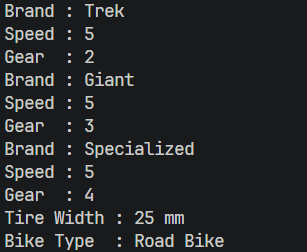
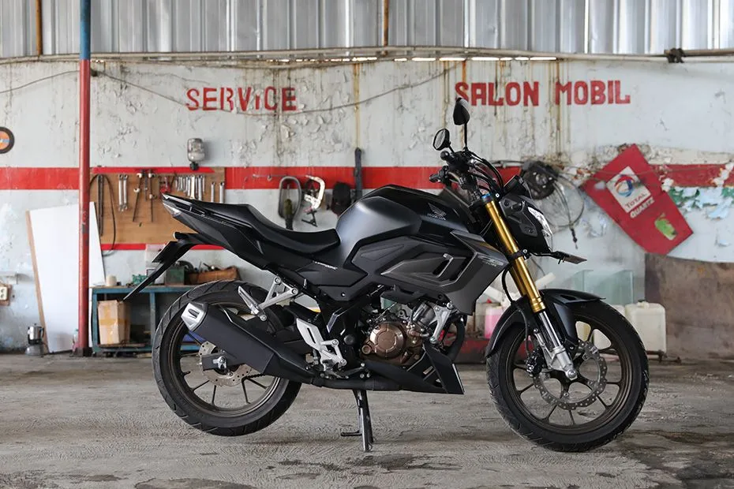
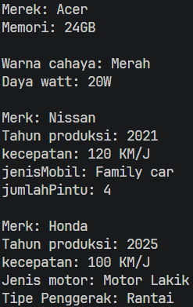

# Laporan Praktikum Pemrograman Berbasis Objek

## Jobsheet 1 - Pengantar Pemrograman Berorientasi Objek

## Identitas Mahasiswa

- Nama : Attaqi Fadhil Arifianto
- NIM : 254107020039
- Kelas : TI - 2G
- Repository : https://github.com/attaqifa/PBO/blob/main/TugasPraktikum1

---

## 3. Percobaan

### 3.1 Percobaan 1
Output:  

### 3.2 Percobaan 2
Output:  

---

## 5. Pertanyaan

1. Jelaskan perbedaan antara object dengan class!  
Jawab: Class adalah prototype, atau blueprint, atau rancangan yang mendefinisikan variable dan method-method pada seluruh objek tertentu. Class berfungsi untuk menampung isi dari program yang akan di jalankan, di dalamnya berisi atribut / type data dan method untuk menjalankan suatu program.
sedangkan Method adalah kumpulan program yang mempunyai nama. Method merupakan tempat bagi programmer untuk memecah program menjadi bagian-bagian yang kecil agar jadi lebih kompleks sehingga dapat di gunakan berulang-ulang

2. Jelaskan alasan gear dan brand dapat menjadi atribut dari object Bike!  
Jawab: Gear dan brand merupakan atribut dari object Bike dikarenakan gear dan brand itu merupakan state dari bike tersebut.

3. Sebutkan salah satu kelebihan utama dari pemrograman berorientasi objek dibandingkan dengan pemrograman prosedural!  
Jawab: Program akan menjadi lebih fleksibel, dan Ketika ada perubahan atau penambahan fitur pada suatu bagian program, perubahan itu tidak akan langsung mengganggu keseluruhan sistem. Jadi, kode juga akan menjadi lebih terstruktur dan juga lebih efisien.

4. Apakah diperbolehkan melakukan pendefinisian dua buah atribut dalam satu baris kode seperti "public String nama, alamat;"?  
Jawab: Boleh, karena keduanya tersebut punya modifier akses yang sama. Selain itu, kedua tipe data nyapun juga sama.

5. Pada class RoadBike, jelaskan alasan atribut brand, speed, dan gear tidak lagi ditulis di dalam class tersebut!  
Jawab: Hal ini dikarenakan class RoadBike menggunakan inheritance dengan chil dari Bike. Jadi, class ini juga akan otomatis mewarisi struktur dari class Bike . Atribut dengan akses private pada class Bike hanya dapat diakses melalui method dari class induk dengan super.printInfo().

---

## 6. Tugas Praktikum

### Identifikasi Objek dan Struktur Class

1. Kendaraan (Superclass)
- Atribut: merk, kecepatan
- Method: setMerk(), tambahKecepatan(), cetakInformasi()

2. Mobil (Subclass dari Kendaraan)
- Atribut: jumlahPintu, tipeTransmisi
- Method: setJumlahPintu(), setTipeTransmisi(), cetakInformasi()

3. Motor (Subclass dari Kendaraan)
- Atribut: kapasitasBagasi, tipeKopling
- Method: setKapasitasBagasi(), setTipeKopling(), cetakInformasi()

4. Laptop  
- Atribut: merk, ramSize
- Method: setMerk(), upgradeRAM(), cetakInformasi()

5. LampuMeja  
- Atribut: warnaLampu, tingkatKecerahan
- Method: setWarna(), aturKecerahan(), cetakInformasi()

### Foto Objek

- Laptop  

- Lampu Meja  

- Motor  

- Mobil  
  

### Output Program (MainDemo)

Output:  
