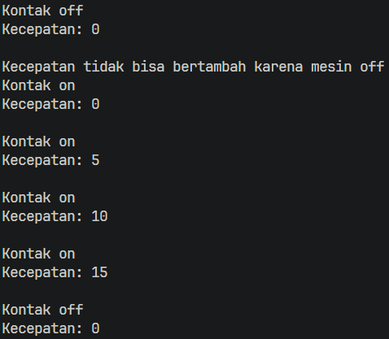
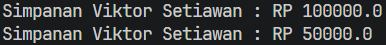
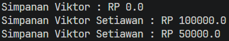

# Laporan Praktikum Pemrograman Berbasis Objek

## Jobsheet 3 - Kelas dan Objek

## Identitas Mahasiswa

- Nama : Attaqi Fadhil Arifianto
- NIM : 254107020039
- Kelas : TI - 2G
- Repository : https://github.com/attaqifa/PBO/tree/main/Jobsheet3

---

## Percobaan

### 3.1 Percobaan 1 - Enkapsulasi
Output:  

3.2 Percobaan 2 - Access Modifier
Output:  

3.4 Percobaan 3 - Getter dan Setter
Output:  
  

### 3.6 Pertanyaan – Percobaan 3 dan 4  
1. Apa yang dimaksud getter dan setter?  
Jawab: Getter adalah method public yang memiliki tipe data return yang digunakan untuk membaca atau mengambil nilai dari atribut yang telah didekalrasikan secara private.  
Setter adalah method public yang tidak memiliki data return atau (void) yang digunakan untuk mengisi atau mengubah hingga manipulasi nilai yang telah didekalrasikan secara private  
2. Apa kegunaan dari method getSimpanan()?  
Method getSimpanan berguna untuk mengambil serta membaca nilai dari atribut simpana yang meiliki sifat private, sehingga kelas lain pun dapat melihat saldo simpanan anggota tanpa bisa mengubah nilainya secara langsung.  
3. Method apa yang digunakan untuk menambah saldo?  
Method yang digunakan untuk menambah saldo pada class Anggota adalah setor(float uang)
4. Apa yang dimaksud konstruktor?  
Konstruktor adalah method khusus dalam java yang dipanggil secara otomatis ketika saat sebuah objek diinstansiasi menggunakan keyowrd new. Konstruktor tersebut digunakan untuk  menginisialisasi nilai awal dari atribut-atribut pada objek tersebut.
5. Sebutkan aturan dalam membuat konstruktor?  
- Nama Konstruktor harus sama persis dengan nama kelas.  
- Konstruktor tidak boleh memiliki tipe data return dan juga void.
- Konstruktor tidak boleh menggunakan modifier abstract, static, final, atau synchronized
6. Apakah boleh konstruktor bertipe private?  
Boleh, karena konstruktor dengan modifier private biasanya digunakan pada perancangan Design Pattern seperti yang digunakan pada Singleton pattern atau pada Ultility Class yang hanya memuat sekumpalan data static.  
7. Kapan menggunakan konstruktor dengan passing parameter?  
Konstruktor dengan passing parameter digunakan ketika sebuah objek tersebut membutuhkan data spesifik atau nilai awal tertentu secara langsung  saat objek tersebut diciptakan atau diintansiasi.  
8. Apa perbedaan inisialisasi atribut dan instansiasi atribut?
Inisialisasi atribut adalah proses memberikan atau mengisi nilai awal pada suat variabel atau atribut bertipe data dasar primitive.  
Instansiasi atribut adalah proses membuat alokasi memori baru untuk atribut yang bertipe data objek atau reference menggunakan keyword new.
9. Apa perbedaan inisialisasi method dan instansiasi method?  
Inisialisasi method adalah proses menuliskan struktur, nama, parameter, dan blok kode logika dari suatu method di dalam sebuah class.  
Instansiasi method adalah proses memanggil atau menjalankan method yang telah didefinisikan melalui objek yang sudah diinstansisiasi.
