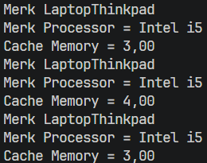
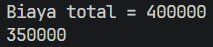
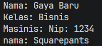
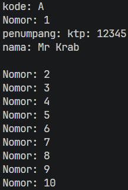
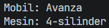
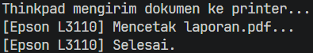

# Laporan Praktikum Pemrograman Berbasis Objek

## Jobsheet 4 - Relasi Kelas

## Identitas Mahasiswa

- Nama : Attaqi Fadhil Arifianto
- NIM : 254107020039
- Kelas : TI - 2G
- Repository : https://github.com/attaqifa/PBO/tree/main/Jobsheet4

---

## Percobaan

### Percobaan 1: Aggregation Satu-ke-Satu (Laptop dan Processor)
Output:  

### Percobaan 2: Aggregation dengan Relasi Ganda (Rental Mobil)
Output:  

### Percobaan 3: Aggregation dengan Dua Role ke Kelas yang Sama (Kereta Api)Output:
Output:  
()
Pertanaan:

### Percobaan 4: Array of Object dan Multiplicity (Gerbong, Kursi, dan Penumpang)
Output:  

### Percobaan 5: Composition (Mobil dan Mesin)

### Percobaan 6: Dependency / Uses-A (Laptop Mencetak Dokumen ke Printer)

### 3.6 Pertanyaan – Percobaan 3 dan 4

1. Apa yang dimaksud getter dan setter?  
   Jawab: Getter adalah method public yang memiliki tipe data return yang digunakan untuk membaca atau mengambil nilai dari atribut yang telah didekalrasikan secara private.  
   Setter adalah method public yang tidak memiliki data return atau (void) yang digunakan untuk mengisi atau mengubah hingga manipulasi nilai yang telah didekalrasikan secara private
2. Apa kegunaan dari method getSimpanan()?  
   Method getSimpanan berguna untuk mengambil serta membaca nilai dari atribut simpana yang meiliki sifat private, sehingga kelas lain pun dapat melihat saldo simpanan anggota tanpa bisa mengubah nilainya secara langsung.
3. Method apa yang digunakan untuk menambah saldo?  
   Method yang digunakan untuk menambah saldo pada class Anggota adalah setor(float uang)
4. Apa yang dimaksud konstruktor?  
   Konstruktor adalah method khusus dalam java yang dipanggil secara otomatis ketika saat sebuah objek diinstansiasi menggunakan keyowrd new. Konstruktor tersebut digunakan untuk menginisialisasi nilai awal dari atribut-atribut pada objek tersebut.
5. Sebutkan aturan dalam membuat konstruktor?

- Nama Konstruktor harus sama persis dengan nama kelas.
- Konstruktor tidak boleh memiliki tipe data return dan juga void.
- Konstruktor tidak boleh menggunakan modifier abstract, static, final, atau synchronized

6. Apakah boleh konstruktor bertipe private?  
   Boleh, karena konstruktor dengan modifier private biasanya digunakan pada perancangan Design Pattern seperti yang digunakan pada Singleton pattern atau pada Ultility Class yang hanya memuat sekumpalan data static.
7. Kapan menggunakan konstruktor dengan passing parameter?  
   Konstruktor dengan passing parameter digunakan ketika sebuah objek tersebut membutuhkan data spesifik atau nilai awal tertentu secara langsung saat objek tersebut diciptakan atau diintansiasi.
8. Apa perbedaan inisialisasi atribut dan instansiasi atribut?
   Inisialisasi atribut adalah proses memberikan atau mengisi nilai awal pada suat variabel atau atribut bertipe data dasar primitive.  
   Instansiasi atribut adalah proses membuat alokasi memori baru untuk atribut yang bertipe data objek atau reference menggunakan keyword new.
9. Apa perbedaan inisialisasi method dan instansiasi method?  
   Inisialisasi method adalah proses menuliskan struktur, nama, parameter, dan blok kode logika dari suatu method di dalam sebuah class.  
   Instansiasi method adalah proses memanggil atau menjalankan method yang telah didefinisikan melalui objek yang sudah diinstansisiasi.

### 5. Tugas

1. Cobalah program dibawah ini dan tuliskan hasil outputnya  
   
2. Pada program diatas, pada class EncapTest kita mengeset age dengan nilai 35, namun pada saat ditampilkan ke layar nilainya 30, jelaskan mengapa.  
   Jawaban: Ketika encap.setAge dijalankan, nilai 35 lebih besar dari 30, sehingga atribut age justru hanya diisi 30, dan ketika getAge() dipanggil, yang dikelbalikan 30 dan bukan 35.
3. Ubah program diatas agar atribut age dapat diberi nilai maksimal 30 dan minimal 18.  
   Jawaban:  
   
4. Pada sebuah sistem manajemen pergudangan kargo ekspedisi, terdapat class Kontainer yang memiliki atribut antara lain nomorResi, namaPemilik, kapasitasMaksimal (dalam kg), dan beratMuatanSaatIni. Kontainer dapat menerima tambahan muatan barang dengan batasan
   kapasitas maksimal yang telah ditentukan. Kontainer juga dapat diturunkan muatannya (bongkar muat). Ketika barang diturunkan, maka jumlah muatan saat ini akan berkurang sesuai dengan nominal berat yang dikeluarkan.Buatlah class Kontainer tersebut, berikan atribut (private), method getter, dan konstruktor sesuai dengan kebutuhan arsitektur enkapsulasi. Uji dengan kelas driver TestLogistik berikut ini untuk memeriksa apakah manajemen state kelas Anda telah berjalan dengan benar:
   Hasil yang diharapkan:
   Jawaban:
5. Modifikasi soal kargo logistik di atas agar nominal berat muatan yang dibongkar/diturunkan
   dalam satu kali pemanggilan method turunkanMuatan() maksimal hanya boleh sebesar 50%
   dari total berat muatan saat ini. Langkah ini diterapkan demi alasan keselamatan kerja
   operasional alat berat (crane). Jika operator mencoba menurunkan muatan melebihi batas
   50% tersebut, sistem harus memblokir aksi dan memunculkan peringatan: "Maaf, demi
   keselamatan, pembongkaran muatan satu kali jalan tidak boleh melebihi 50% dari muatan
   saat ini!".
   Jawaban:
6. Modifikasi kelas Main TestLogistik agar parameter jumlah berat barang yang dimasukkan
   (tambahMuatan) maupun berat barang yang dibongkar (turunkanMuatan) dapat menerima
   input nilai dinamis dari pengguna secara interaktif melalui terminal menggunakan utilitas
   java.util.Scanner.
   Jawaban:
7. Sebuah aplikasi pemesanan tiket bioskop memerlukan kelas Tiket untuk mengelola data
   pemesanan secara aman. Kelas ini harus memiliki atribut private: judulFilm (String),
   hargaDasar (double), dan statusPembayaran (boolean).
   Ketentuan pengesetan nilai objek:
   ● Konstruktor harus menerima parameter judulFilm dan hargaDasar. Nilai awal
   statusPembayaran selalu diset false (Belum Dibayar).
   ● Atribut hargaDasar tidak boleh bernilai negatif. Jika input yang dimasukkan kurang dari 0,
   otomatis set nilai default ke Rp 35.000.
   ● Sediakan method lakukanPembayaran() untuk mengubah statusPembayaran menjadi
   true.
   ● Nilai statusPembayaran hanya boleh dibaca (Read-Only) menggunakan getter, tidak boleh
   memiliki fungsi setter langsung dari luar kelas demi alasan keamanan transaksi.
   ● Uji kode Anda menggunakan kelas TestBioskop berikut:
   Jawaban:
