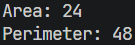
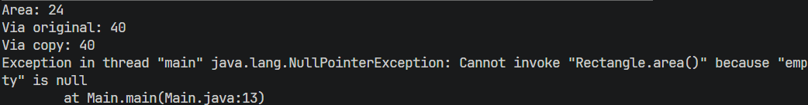
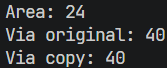
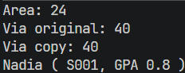
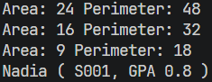
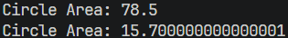

# Laporan Praktikum Pemrograman Berbasis Objek

## Jobsheet 2 - Kelas dan Objek

## Identitas Mahasiswa

- Nama : Attaqi Fadhil Arifianto
- NIM : 254107020039
- Kelas : TI - 2G
- Repository : https://github.com/attaqifa/PBO/blob/main/TugasPraktikum2

---

## 3. Langkah Kerja

### Langkah 2
Output:  

  
program menampilkan Rectangle 6x4.

### Langkah 4
Output:  
  
output sama persis dengan Langkah 3, tapi kode Main.java jauh lebih
pendek sekarang.

### Langkah 5
Output:  
  
NullPointerException selalu muncul kalau kamu memanggil method pada
referensi yang belum menunjuk ke objek mana pun (null). Solusinya selalu sama: pastikan
objeknya sudah benar-benar dibuat dengan new sebelum method-nya dipanggil.

Sesudah:  

### Langkah 6
Output:  
  
program berhasil dikompilasi ulang dan baris terakhir menampilkan Nadia
(S001, GPA: 3.8).

### Langkah 7
Output:  
  
program mencetak tiga baris area/perimeter (satu per elemen array, nilainya
beda-beda karena tiap Rectangle punya ukurannya sendiri), diikuti baris Nadia (S001, GPA:
3.8). 

---

## D. Tugas dan Deliverable
1.Method area() dan circumference() mengembalikan double, hitung pakai rumus
lingkaran biasa (Math.PI * radius * radius untuk luas, 2 * Math.PI * radius untuk keliling). Buktikan dengan membuat satu objek Circle di Main (radius 5) dan
mencetak kedua hasilnya.  
Output:  
  
2. Jawab singkat (2-3 kalimat masing-masing): (a) apa bedanya objek dengan referensi ke
objek? (b) tepatnya kapan konstruktor sebuah kelas dijalankan?
(a). Perbedaan objek sendiri adalah instance nyata dari sebuah kelas yang menyimpan data dan memiliki perilaku, sedangkan referensi ke objek adalah variabel yang menunjuk atau merujuk pada objek tersebut di memori.
(b). KOnstruktor dapat dijalankan ketika objek baru dibuat menggunakan kata kunci. Konstruktor tersebut digunakan untuk menginisialisasi atribut atau keaadaan awal objek.
